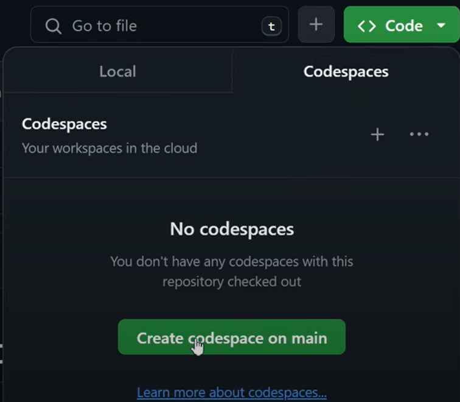
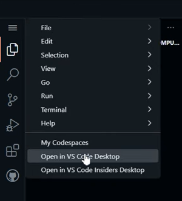
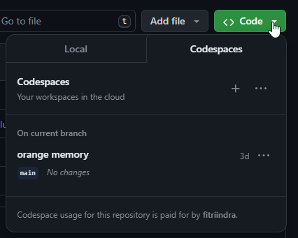
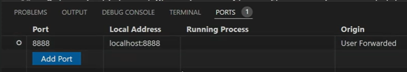
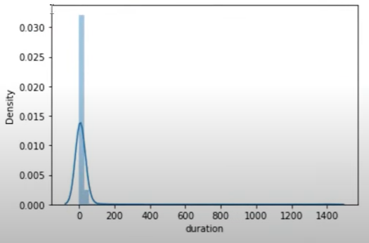
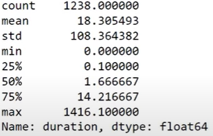
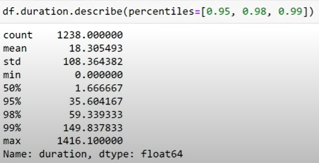
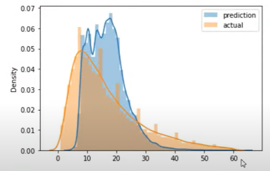

# Introduction
## 1.1. Introduction

The are 3 stages for the implementattion of best practices for machine learning:
- Design
- Train the model
- Operate. Machine learning model deployment is part of operate stage

MLOps is a set of practices for automating everything that needs to be done in all of the stages.

## 1.2. Environment preparation

There are several options to configure the environment. In this section we will try to use three different kind of setup: using Github Codespaces, AWS and Google Cloud


### Configuring Environment with Github Codespaces

1. Open github and create/open repository
2. Click on `Code` button, select Codespaces.If there are no Codespaces for the repository, it will show `Create codespaces on main` button

    

3. New window will open. After the codespaces is created, we can open it in our own VS Code Desktop by selecting menu on the sidebar

    

4. Install Github Codespaces in VS Code Extensions to use the codespace in VS Code Desktop
5. Install Anaconda distribution
`wget https://repo.anaconda.com/archive/Anaconda3-2022.05-Linux-x86_64.sh`
`bash Anaconda3-2022.05-Linux-x86_64.sh`
6. The codespace can be accessed from the same button in Github

    

### Configuring Environment in AWS

1. Open AWS console and create an EC2 instance
2. Click `Launch Instance` button to enable the instance
3. Choose the OS & architecture, instance type (choose minimum t2.large for ML applications), select or create key pair, configure storage and leave the rest of the options as default.
4. Use the public IP and connect to the server. 

    `ssh -i ~/.ssh/<key filename>.pem ubuntu@<public IP address>`
    
    to save the connection, edit the file `.ssh/config`
    ```
    Host mlops-zoomcamp
        HostName <public IP Address>
        User <username>
        IdentityFile c:/Users/Fitri/.ssh/gpc
        StrictHostKeyChecking no
    ```

    to connect just type `ssh mlops-zoomcamp` instead of the previous one
5. Download Anaconda and install into the server

    `wget <Anaconda installation file URL>`
    
    `bash <Anaconda filename>.sh`
6. Install Docker

    `sudo update`

    `sudo apt install docker.io`
7. Install the latest Docker compose from https://github.com/docker/compose/releases

    `wget <Docker compose URL> -O docker-compose`

    make the file executable: `chmod +x docker-compose`
8. To access the Docker compose from anywhere, edit `.bashrc` file

    `export PATH="${HOME}/<docker-compose location>:${PATH}"`

    execute the file  `source .bashrc` and then
    check using `which docker-compose`

    at first we need to use `sudo` to run docker, but if we want to use docker without `sudo`, run: 
    `sudo groupadd docker` and `sudo usermod -aG docker $USER`.
     Logout and the login again to the server

9. Open VSCode and install Remote - SSH extensions
10. Open remote window and connect to the server. After the VSCode is connected, click Open Folder to open the repository folder
11. Use port-forwarding to connect server into our local machine. Click Ports tab inside VSCode (on the right side of Terminal window)
    

    Now you can use jupyter notebook from your local machine `localhost:8888`


## 1.3. (Optional) Training a ride duration prediction model

### Reading Parquet files instead of CSV
Since 05/13/3022 all of the data in [NY Taxi Trip](https://www.nyc.gov/site/tlc/about/tlc-trip-record-data.page) will be stored in the Parquet format.
1. Download the data `wget <data URL>`
2. Start the jupyter notebook. Use  `pd.read_parquet()`. Install `pyarrow` or `fastparquet` to use the function.

### Training a ride duration prediction model

- Data can be downloaded from [NY Taxi Trip](https://www.nyc.gov/site/tlc/about/tlc-trip-record-data.page) and the metadata can be seen in [Yellow Taxi Trip Metadata](https://www.nyc.gov/assets/tlc/downloads/pdf/data_dictionary_trip_records_yellow.pdf) and [Green Taxi Trip Metadata](https://www.nyc.gov/assets/tlc/downloads/pdf/data_dictionary_trip_records_green.pdf). 
- Filtering the data
   
   example: `df = df[df.trip_type == 2]` will filter green taxi data with `Dispatch` type (see [Green Taxi Trip Metadata](https://www.nyc.gov/assets/tlc/downloads/pdf/data_dictionary_trip_records_green.pdf))
- To calculate the duration for the taxi trip we can use:
    ```
    #convert into datetime value
    df.lpep_dropoff_datetime = pd.to_datetime(df.lpep_dropoff_datetime)
    df.lpep_pickup_datetime = pd.to_datetime(df.lpep_pickup_datetime)


    #calculate the duration (the result will be in x days HH:MM:ss format)
    df['duration'] = df.lpep_dropoff_datetime - df.lpep_pickup_datetime

    #change the format into minutes
    df.duration = df.duration.apply(lambda td: td.total_seconds()/60)

    ```

- checking the data distribution

    ```
    import seaborn as sns
    import matplotlib.pyplot as plt

    sns.distplot(df.duration)
    ```
    

    or we can use: `df.duration.describe()`

    

    look at the percentile, e.g: `df.duration.describe(percentiles=[0.95, 0.98, 0.99])`

    

    Most of the data is between 1 minute and less than 1 hour so we can use extra filtering to include only these data points.

    `df = df[(df.duration >= 1 ) & df.duration <= 60]`
- Next we perform feature selection and divide into categorical and numerical column
    ```
    categorical = ['PULocationID', 'DOLocationID']
    numerical = ['trip_distance']
    ```
    for now we only use these three columns, but in real use case we might want to use another column(s).

- Perform One-Hot-Encoding for the categorical columns.

    ```
    from sklearn.feature_extraction import DictVectorizer
    
    df[categorical] = df[categorical].astype(str)

    train_dicts = df[categorical + numerical].to_dict(orient='records')

    dv = DictVectorizer()
    X_train = dv.fit_transform(train_dicts)
    ```
- specify `target` column which is `duration` because we want to predict the trip duration
    ```
    target = 'duration'
    y_train = df[target].value
    ```

- train model using `Linear Regression`
    ```
    from sklearn.linear_model import LinearRegression

    lr = LinearRegression()
    lr.fit(X_train, y_train)

    y_pred = lr.predict(X_train)
    ```
- Visualize the prediction and actual result
    ```
    sns.distplot(y_pred, label='prediction')
    sns.distplot(y_train, label='actual')

    plt.legend()
    ```

    

- calculate the RMSE. Note: the old `mean_squared_error` is deprecated, so we will use `root_mean_squared_erro`r instead
    ```
    from sklearn.metrics import root_mean_squared_error

    rmse_val = root_mean_squared_error(y_train, y_pred)
    ```
## 1.4. Course overview

## 1.5. MLOps maturity model
# Homework
[homework solution](homework.ipynb)