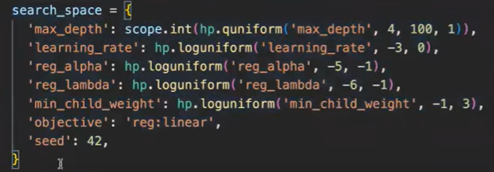
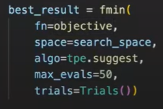
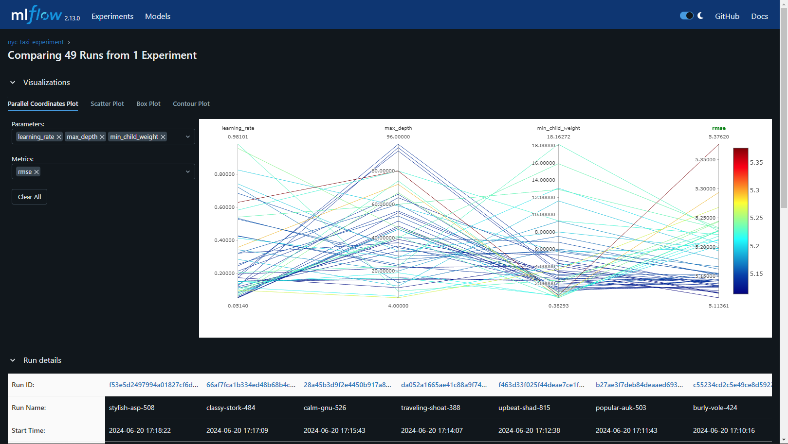
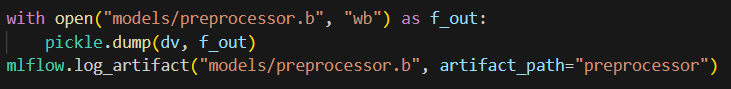
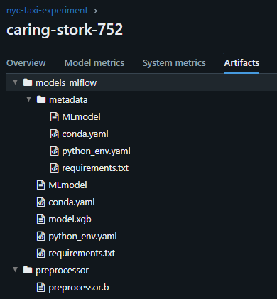
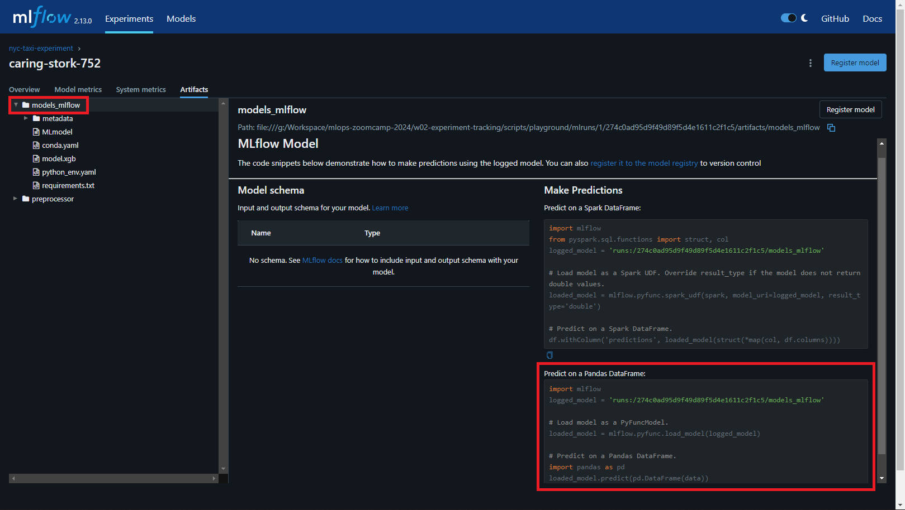
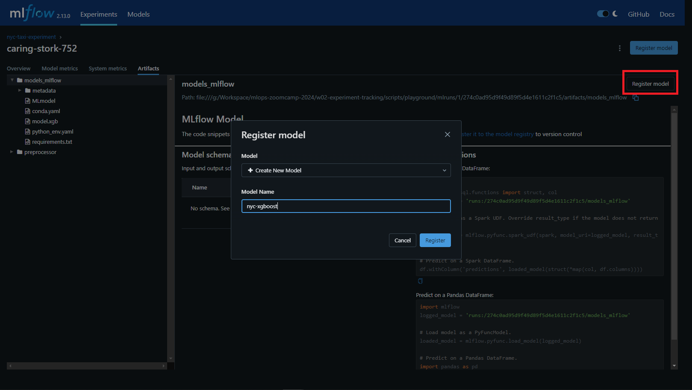
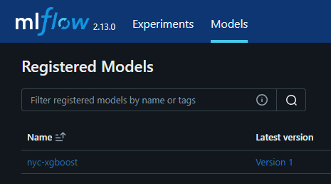

# Experiment Tracking
## 2.1. Introduction into Tracking Experiment

### Important concepts:
- ML experiment: the process of building an ML model
- Experiment run: each trial in an ML experiment
- Run artifatcs: any file that is associated with an ML run
- Experiment metadata

Experiment tracking keeps track of all the relevant information from an ML experiment, such as: code, environment, data, model, hyperparameters, metrics, and other logs. The experiment tracking is important because of: reproducibility, organization, and optimization.

Manual tracking experiment, e.g: using spreadsheets is not enough because it is prone to error, no standard format, no visibility and collaboration among team members. To make the experiment tracking more coherent, we can use experiment tracker such as MLflow. [MLflow](https://mlflow.org) contains four main modules:
- tracking
- models
- model registry
- projects

MLflow automatically logs information such as: parameters, metrics, metadata, artifacts, models, and extra information e.g: source code, version of the code, start and end time, author.

## 2.2. Getting Started with MLflow

- Prepare the local environment and install MLflow client
    The requirements for this is already listed in [requirements.txt](requirements.txt). To install run: 
    - create conda environment: `conda create -n experiment-tracking-env python=3.9`

    - activate the environment: `conda activate experiment-tracking-env`

    - install all libraries in requirements.txt: `pip install -r requirements.txt`
- Open the MLflow UI

    `mlflow ui --backend-store-uri sqlite:///mlflow.db`

    this command is to tell the MLflow to store the artifacts and metadata into sqlite

- Add MlFlow into the existing notebook
    We can use existing notebook [`duration-prediction`](scripts/playground/duration-prediction.ipynb) to try MLflow.
    - import MLflow into notebook: 
    
        `import mlflow`

    - set the tracking URI into sqllite: 
    
        `mlflow.set_tracking_uri("sqlite:///mlflow.db")`

    - use newly created experiment: 
    
        `mlflow.set_experiment('nyc-taxi-experiment')`
        
        If the experiment already exists in the MLflow db, it will use the experiment. If it does not exists, the MLflow will create a new experiment.

    - add MLFLow by adding new run into the notebook: 
        
        `with mlflow.start_run():`
        
        Every code inside the block will be associated with the current run.

    - add tag: 
        
        `mlflow.set_tag("<key>, "<value>")`

    - add params: 
        
        `mlflow.set_param("<key>, "<value>")`


> For more information about MLFLow: 
[MLFLow quickstart](https://mlflow.org/docs/latest/getting-started/intro-quickstart/index.html)
## 2.3. Experiment Tracking with MLflow
We can use `hyperopt` library to find best set of hyperparameters to run the model.

- import the `hyperopt` library:
    ```
    from hyperopt import fmin, tpe, hp, STATUS_OK, Trials
    from hyperopt.pyll import score
    ```

- define the objective function. 

    This objective function minimize the loss function during the optimization.


- define a search space.
    
    Hyperopt will explore the ranges of hyperparameters inside the search spaces to find the best result. 
    
    Example of search space for xgboost method:

    

    > For more information about hyperopt search spaces: https://hyperopt.github.io/hyperopt/getting-started/search_spaces/

- pass information (objective function and search space) into `fmin` function to search for best result.

    Example of `fmin` function:

    
    
- Run the [experiment notebook](scripts/playground/duration-prediction-hyperopt.ipynb) and see the result in MLflow UI:

    example of run comparison from the experiment:
    

- use automatic logging to log metrics, parameters, and models without manually specifiying the log statements. 
    `mlflow.autolog()`
    > For more information about autolog: https://mlflow.org/docs/latest/python_api/mlflow.html?highlight=autolog#mlflow.autolog

## 2.4. Model Management

*Source: https://neptune.ai/blog/ml-experiment-tracking*

Experiment tracking is just a subset of MLOps, there is another part of MLOps called model management which includes: model versioning, model deployment, and scaling hardware.

If we just save several models manually into different directory or using different filename it will be hard to keep track of the model version. Without model management it will prone to error, no clear versioning, and no model lineage (can't keep the metadata of the model, e.g: hyperparameters, data).

There two ways of saving models into MLflow:
- using artifacts:

    `mlflow.log_artifacts(local_path="<path>", artifact_path="<path>")`

- using `log_model`:

    `mlflow.<model_flavor>.log_model(<modelname>, artifact_path="<path>")`

It is useful to save the preprocessing steps into the artifacts. In the future we might need to preprocess the new data before retraining new model.
```
with open("<preprocessor path>.b", "wb") as f_out:
    pickle.dump(<preprocessing>, f_out)
mlflow.log_artifact("<preprocessor path>.b", artifact_path="<preprocessor path>")
```
Example:


The model and preprocessor will be saved in MLflow database and can be viewed in MLFLow UI:


### Making predictions using saved model
We can use the saved model to make prediction using new data. MLflow provides the code for loading the model inside the artifacts:


```
import mlflow

logged_model = 'runs:/<run number>/<artifact path>'
loaded_model = mlflow.<model flavor>.load_model(logged_model)

loaded_model.predict(<dataframe>)
```

> The model will be saved in MLflow model format and can be loaded and deployed using another framework.

## 2.5. Model Registry
After training a few models, we can store model in model registry. Once the model is registered in model registry the engineer in charge of deploying the model can inspect the models and see the informations related to the model, such as model size, hyperparameters, performance, etc. 

To register model, we can click the Register Model button inside the artifacts section. We can select the model registry name or create a new one. 

The registered model can be viewed in Model menu inside MLflow.


> In earlier version of MLflow we can change the stage of the model, however since the MLflow 2.9.0 version the Model Stage is deprecated and will be removed in a future major release. For more information: https://mlflow.org/docs/latest/model-registry.html#id21

### Using MLflow Client
This module provides CRUD interface to experiments, run, model version, and model registry in MLflow and translate it into MLflow API calls.

```
from mlflow.tracking import MlflowClient
MLFLOW_TRACKING_URI = "<PATH>"
client = MlflowClient(tracking_uri=MLFLOW_TRACKING_URI)
```

Example of MLflow Client code: [mlflow-client.ipynb](scripts/playground/mlflow-client.ipynb)

`MlflowClient` class can be used to:
- creates and manages experiments and runs
- creates and manages model registry and model versions.

> For more information about model registry in MLflow: https://mlflow.org/docs/latest/model-registry.html

## 2.6. MLflow in Practice
Let's consider three different scenarios for running MLflow:
- A single data scientist participating in an ML competition
- A cross functional team with data scientist working on an ML model
- Multiple data scientist working on multiple ML models

Depending on the scenario, we need to adjust MLflow configuration. The options are:
- Backend store: local filesystem, SQLAlchemy compatible DB (e.g: SQLite)
- Artifact store: local filesystem, remote (e.g: s3 bucket)
- Tracking server: no tracking server, localhost, remote

### Scenario 1: A single data scientist participating in an ML competition
In this scenario the configurations are:
- no tracking server
- backend and artifact store: local filesystem

All of the experiments data and artifacts are saved in local filesystem and can be accessed by using URI in `mlflow.get_tracking_uri()`. Because there is no backend store for this scenario we **cannot use the model registry**.

To launch the MLflow server we need to use command: 

`mlflow ui`

> The notebook for this scenario: [scenario-1.ipynb](scripts/running-mlflow-examples/scenario-1.ipynb)

### Scenario 2: A cross functional team with data scientist working on an ML model
In the second scenario, the MLflow configurations are:
- tracking server: yes, local
- backend store: SQLite
- artifacts store: local filesystem

To launch the MLflow server we need to use command: 

`mlflow server --backend-store-uri sqlite:///mlflow.db --default-artifact-root ./artifacts`

and add the following tracking URI in the script:

`mlflow.set_tracking_uri("http://127.0.0.1:5000")`

> The notebook for this scenario: [scenario-2.ipynb](scripts/running-mlflow-examples/scenario-2.ipynb)

### Scenario 3: Multiple data scientist working on multiple ML models
In the last scenario, the MLflow congigurations are:
- tracking server: yes, remote server (EC2)
- backend store: SQLite
- Artifact store: s3 bucket

> To use AWS, please read the documentation from MLOps Zoomcamp: [MLFflow on AWS](https://github.com/DataTalksClub/mlops-zoomcamp/blob/main/02-experiment-tracking/mlflow_on_aws.md)

After creating instance and connect to the EC2 server:
- install mlflow: `pip3 install mlflow boto3 psycopg2-binary`
- configure credentials for AWS: `aws configure`. Check the credentials using `aws s3 ls`
- run the MLflow server: 

    `mlflow server -h 0.0.0.0 -p 5000 --backend-store-uri postgresql://DB_USER:DB_PASSWORD@DB_ENDPOINT:5432/DB_NAME --default-artifact-root s3://S3_BUCKET_NAME`
- to access the MLflow UI, use the AWS public IPv4 DNS address with port 5000 or use `mlflow.get_tracking_uri()` function.
- access the artifacts on S3 bucket in AWS.

> The notebook for this scenario: [scenario-3.ipynb](scripts/running-mlflow-examples/scenario-3.ipynb)

## 2.7 MLflow: Benefits, Limitations and Alternatives

### Benefits
Benefits of remote tracking server:
- share experiments and data with other data scientist
- collaborate with other members to build and deploy the model
- more visibility of the experiments

### Issues
Issues with using a remote tracking server:
- **security**

    restrict access to the server, e.g: using VPN to access the experiment data
- **scalability**

    Resources for more information on scalability:
    - [Deploy MLflow on AWS Fargate](https://github.com/aws-samples/amazon-sagemaker-mlflow-fargate) 
    - [MLflow at Company Scale](https://www.youtube.com/watch?v=S27sM0K0gNw&ab_channel=Databricks)
- **Isolation**
    - standards for naming experiments, models, and a set of default tags
    - restrict access to artifacts

### Limitations
- **Authentication & Users**

    There is no authentication in MLflow

- **Data versioning**

    MLflow does not provide built-in data versioning that is used to train the model.

- **Model/Data Monitoring**

    Outside of scope of Mlflow

### Alternatives
There are a few free and paid alternatives to MLflow:
- [Neptune](https://neptune.ai/)
- [Comet](https://www.comet.com/site/)
- [Weights & Biases](https://wandb.ai/site)
- and [many more](https://neptune.ai/blog/best-ml-experiment-tracking-tools)

# Homework
[homework solution](homework.ipynb)