> This is my note for 2024 cohort using Mage, for 2023 cohort notes using Prefect, please see [Prefect notes](prefect.md)

# Orchestration and ML Pipelines
## 3.1. Introduction: ML pipelines and Mage
### Machine Learning Pipeline
Using notebook and just executing the cell sequentially can be a disorganized way to do an experiment because we might forget to execute some cells in order. By using pipeline we can divide the experiment flow into several steps, such as:
- data ingestion
- data transformation: filtering, removing outliers, etc
- preparing data: splitting data for the model
- hyperparameter tuning
- train model 

Orchestration is important because we need scheduling for running the experiment, collaboration among team members (data scientist, DevOps), and ensure scalability. We can use special tools for workflow orchestration, such as by using Airflow, Prefect, Mage, etc. The process is centralized so each team members can contribute and collaborate to the code. These tools usually have a dependency management to ensure each step required to do the workflow is executed properly.

### Mage
#### Running Mage in Codespace
1. Fork [Mage Github](https://github.com/mage-ai/mlops)
2. Create codespace and open using VS Code
3. Before we run the `start.sh` script, we need to create a new folder because in `docker-compose.yml` we need to have `.gitconfig` folder for local Github config.

*No .gitconfig folder for running Docker Compose*

    Create the folder: `touch .gitconfig`
4. Go back to the work folder and run the script `./scripts/start.sh `

*Start Mage script*
5. After Mage is started, we can visit the Mage UI from [`http://localhost:6789/`](http://localhost:6789/)

*Port available for opening Mage UI*

    
    
    *Mage UI*

    
    
    *Mage text editor*

6. When we edit file using Mage UI, we can also see the change in our vscode under the `mlops` folder

    

    *Mage mlops folder*

#### Running Mage with Docker (on Windows)
1. Ensure that Docker and Docker Compose is installed and Docker is running.
2. Clone Mage Github: `git clone https://github.com/mage-ai/mlops.git`
3. Move into directory `mlops`

    
4. If we run the `start.sh` script directly, there will be an error related to the path in Windows. To solve this we need to modify two files:
    - Modify `docker-compose.yml` file by editing some variables in `volumes`:
        - replacing `.` with `${PWD}`
        - adding `{}` in `MAGE_CODE_PATH`
        - adding `""` into each lines

        
    - Modify `start.sh`:  `MAGE_CODE_PATH=home/src`
    
5. Run the script: `./scripts/start.sh `

## 3.2. Data preparation: ETL and feature engineering
### Creating New Mage Project
1. Open Mage UI [`http://127.0.0.1:6789/`](http://127.0.0.1:6789/)

    
2. Open text editor and click New Mage Project menu

    
3. Since we have multi project setup, we need to select the project from the breadcrumbs. 

    
    > If the project is not registered, we need to register the project using Settings
4. Create New Pipeline -> Standard pipeline

    

    give a name and description to the new pipeline

    
### Data Ingestion
1. Add new block: All Blocks --> Data loader -> Base template (generic)
    
    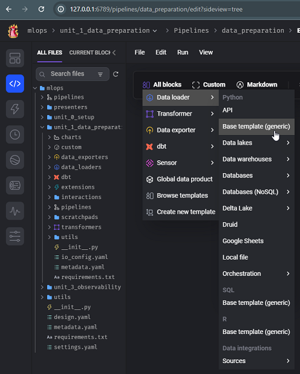
2. Give a name to the ingest block

    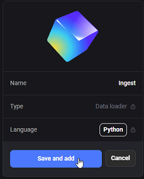
3. After the text editor for the newly created block appears, enter this code for ingesting data:

    ```
    import requests
    from io import BytesIO
    from typing import List

    import pandas as pd

    if 'data_loader' not in globals():
        from mage_ai.data_preparation.decorators import data_loader


    @data_loader
    def ingest_files(**kwargs) -> pd.DataFrame:
        dfs: List[pd.DataFrame] = []

        for year, months in [(2024, (1, 3))]:
            for i in range(*months):
                response = requests.get(
                    'https://github.com/mage-ai/datasets/raw/master/taxi/green'
                    f'/{year}/{i:02d}.parquet'
                )

                if response.status_code != 200:
                    raise Exception(response.text)

                df = pd.read_parquet(BytesIO(response.content))
                dfs.append(df)

        return pd.concat(dfs)
    ```
4. Run the code

    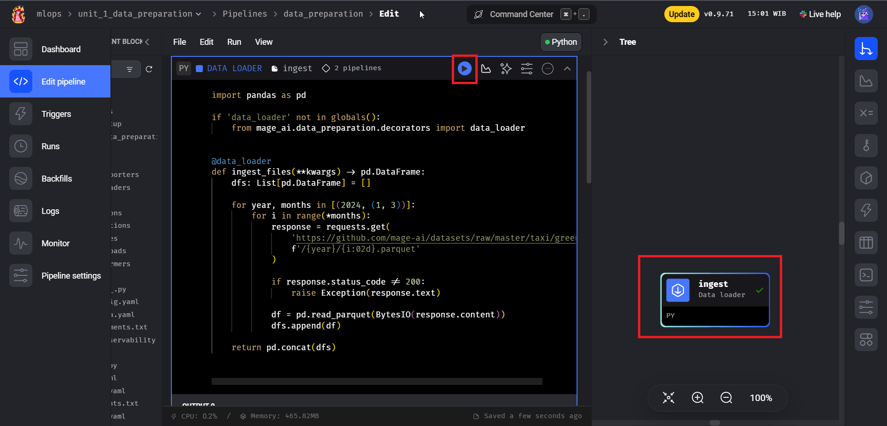
5. To display chart, click Chart button and add the chart type.
    
    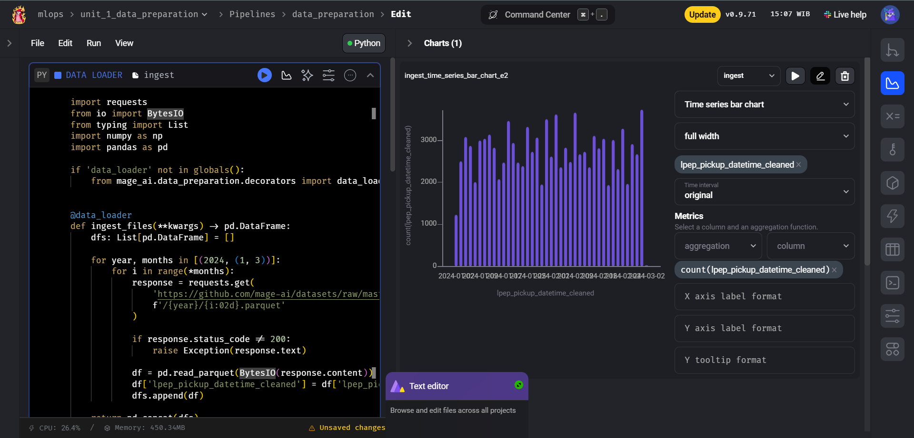
    > If the chart is not displayed, add `df['lpep_pickup_datetime_cleaned'] = df['lpep_pickup_datetime'].astype(np.int64) // 10**9` before `dfs.append(df)`. Do not forget to import `numpy` library.
    
    Add another chart:

    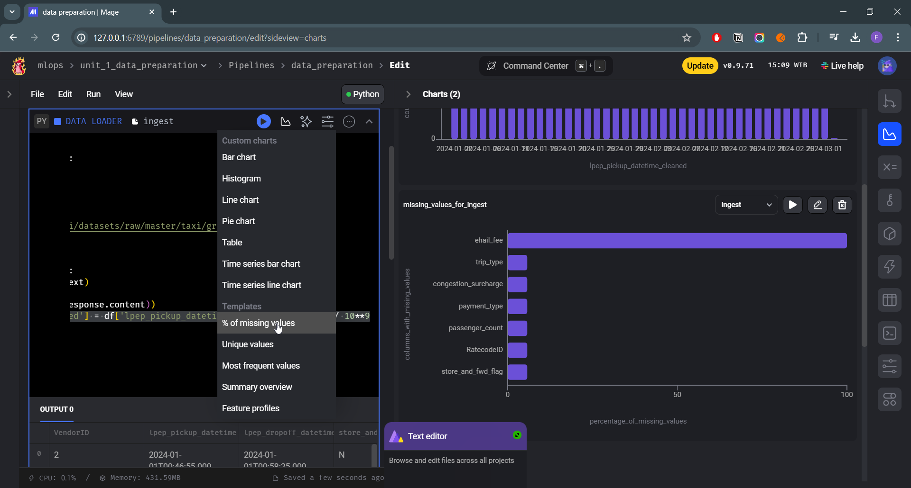

### Data Preparation
#### Utility Helper Function
1. Add utility codes into one folder, called `utils`. These codes will be used for data transformation.
    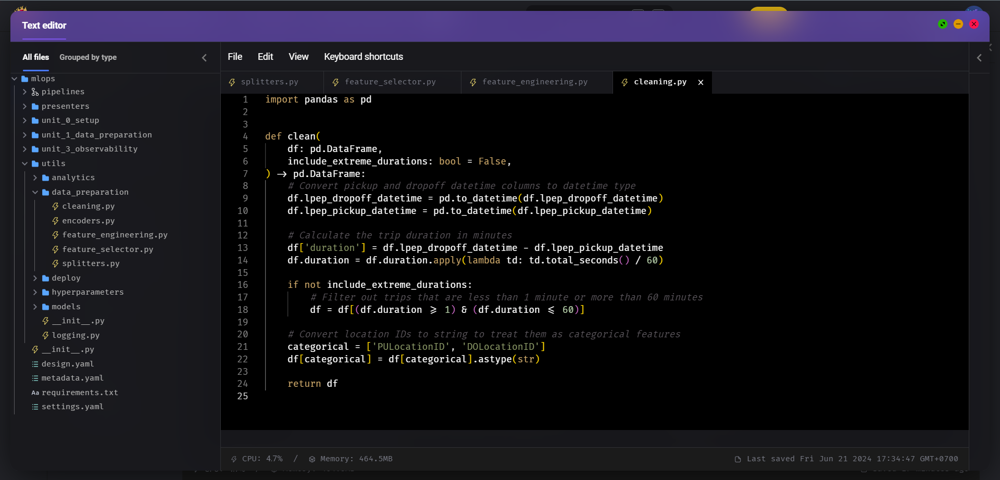
2. Add `cleaning.py`
    ```
    import pandas as pd

    def clean(
        df: pd.DataFrame,
        include_extreme_durations: bool = False,
    ) -> pd.DataFrame:
        # Convert pickup and dropoff datetime columns to datetime type
        df.lpep_dropoff_datetime = pd.to_datetime(df.lpep_dropoff_datetime)
        df.lpep_pickup_datetime = pd.to_datetime(df.lpep_pickup_datetime)

        # Calculate the trip duration in minutes
        df['duration'] = df.lpep_dropoff_datetime - df.lpep_pickup_datetime
        df.duration = df.duration.apply(lambda td: td.total_seconds() / 60)

        if not include_extreme_durations:
            # Filter out trips that are less than 1 minute or more than 60 minutes
            df = df[(df.duration >= 1) & (df.duration <= 60)]

        # Convert location IDs to string to treat them as categorical features
        categorical = ['PULocationID', 'DOLocationID']
        df[categorical] = df[categorical].astype(str)

        return df
    ```
3. Add `feature_engineering.py`
    ```
    from typing import Dict, List, Union
    from pandas import DataFrame

    def combine_features(df: Union[List[Dict], DataFrame]) -> Union[List[Dict], DataFrame]:
        if isinstance(df, DataFrame):
            df['PU_DO'] = df['PULocationID'].astype(str) + '_' + df['DOLocationID'].astype(str)
        elif isinstance(df, list) and len(df) >= 1 and isinstance(df[0], dict):
            arr = []
            for row in df:
                row['PU_DO'] = str(row['PULocationID']) + '_' + str(row['DOLocationID'])
                arr.append(row)
            return arr
        return df

    ```
4. Add `feature_selector.py`
    ```
    from typing import List, Optional
    import pandas as pd

    CATEGORICAL_FEATURES = ['PU_DO']
    NUMERICAL_FEATURES = ['trip_distance']

    def select_features(df: pd.DataFrame, features: Optional[List[str]] = None) -> pd.DataFrame:
        columns = CATEGORICAL_FEATURES + NUMERICAL_FEATURES
        if features:
            columns += features

        return df[columns]
    ```
5. Add `splitters.py`
    ```
    from typing import List, Tuple, Union
    from pandas import DataFrame, Index

    def split_on_value(
        df: DataFrame,
        feature: str,
        value: Union[float, int, str],
        drop_feature: bool = True,
        return_indexes: bool = False,
    ) -> Union[Tuple[DataFrame, DataFrame], Tuple[Index, Index]]:
        df_train = df[df[feature] < value]
        df_val = df[df[feature] >= value]

        if return_indexes:
            return df_train.index, df_val.index

        if drop_feature:
            df_train = df_train.drop(columns=[feature])
            df_val = df_val.drop(columns=[feature])

        return df_train, df_val
    ```

#### Data Transformation
1. Add new transformer block: All Blocks --> Transformer --> Base template (generic)

    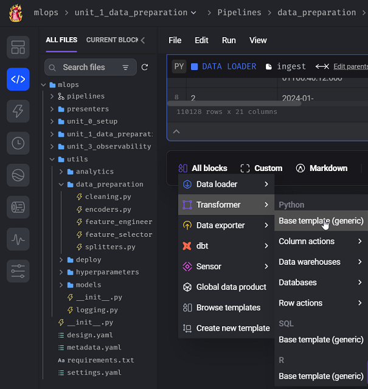

2. Give a name the the newly created transformer block

    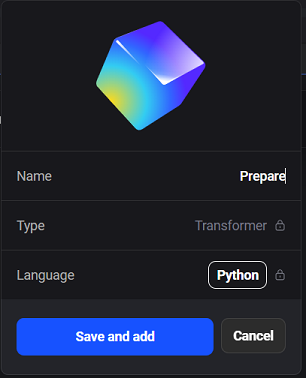

3. Add the transformer code
    ```
    from typing import Tuple
    import pandas as pd
    from mlops.utils.data_preparation.cleaning import clean
    from mlops.utils.data_preparation.feature_engineering import combine_features
    from mlops.utils.data_preparation.feature_selector import select_features
    from mlops.utils.data_preparation.splitters import split_on_value

    if 'transformer' not in globals():
        from mage_ai.data_preparation.decorators import transformer

    @transformer
    def transform(
        df: pd.DataFrame, **kwargs
    ) -> Tuple[pd.DataFrame, pd.DataFrame, pd.DataFrame]:
        split_on_feature = kwargs.get('split_on_feature')
        split_on_feature_value = kwargs.get('split_on_feature_value')
        target = kwargs.get('target')

        df = clean(df)
        df = combine_features(df)
        df = select_features(df, features=[split_on_feature, target])

        df_train, df_val = split_on_value(
            df,
            split_on_feature,
            split_on_feature_value,
        )

        return df, df_train, df_val
    ```
4. Add some new variable to control the bahaviour if we wanted to reuse the pipeline for another dataset.

    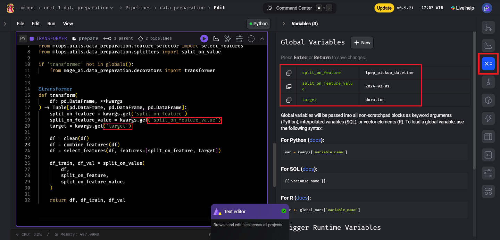
    Set the default value  `split_on_feature` into `lpep_pickup_datetime`, `split_on_feature_value` into `2024-02-01` and `target` into `duration` column.
5. Run the code

#### Data Visualization
1. Add histogram chart to visualize the distribution

    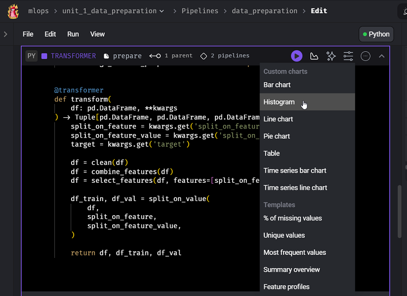

2. Modify the last two lines in histogram code:
    ```
    col = 'trip_distance'
    x = df_1[df_1[col] <= 20][col]
    ```

    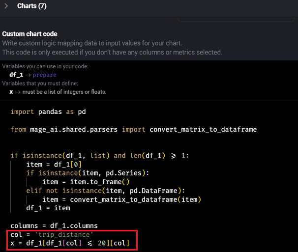

    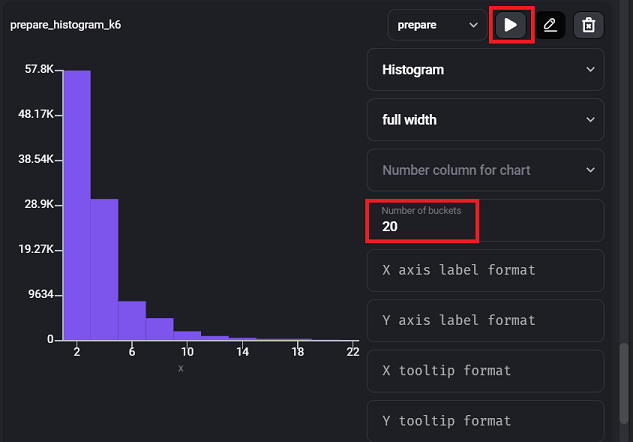

### Build Training Set

#### Build Encoders
1. Add new encoder file under `utils/data_preparation` folder
2. Add the encoder code
    ```
    from typing import Dict, List, Optional, Tuple
    import pandas as pd
    import scipy
    from sklearn.feature_extraction import DictVectorizer

    def vectorize_features(
        training_set: pd.DataFrame,
        validation_set: Optional[pd.DataFrame] = None,
    ) -> Tuple[scipy.sparse.csr_matrix, scipy.sparse.csr_matrix, DictVectorizer]:
        dv = DictVectorizer()

        train_dicts = training_set.to_dict(orient='records')
        X_train = dv.fit_transform(train_dicts)

        X_val = None
        if validation_set is not None:
            val_dicts = validation_set[training_set.columns].to_dict(orient='records')
            X_val = dv.transform(val_dicts)

        return X_train, X_val, dv
    ```
4. Add new data exporter block: All Block --> Data Exporter --> Base template (generic)

    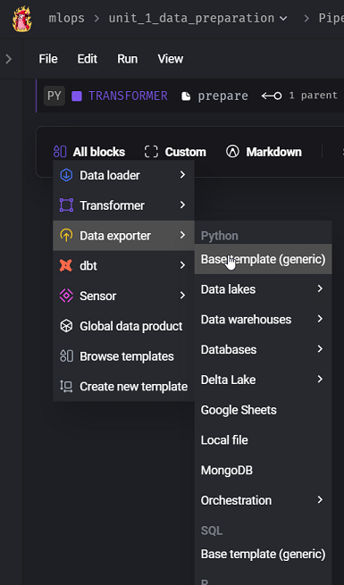
5. Give a name to the exporter block

    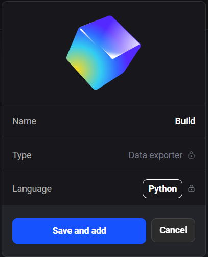
6. Add exporter code
    ```
    from typing import List, Tuple
    from pandas import DataFrame, Series
    from scipy.sparse._csr import csr_matrix
    from sklearn.base import BaseEstimator
    from mlops.utils.data_preparation.encoders import vectorize_features
    from mlops.utils.data_preparation.feature_selector import select_features

    if 'data_exporter' not in globals():
        from mage_ai.data_preparation.decorators import data_exporter
    if 'test' not in globals():
        from mage_ai.data_preparation.decorators import test

    @data_exporter
    def export(
        data: Tuple[DataFrame, DataFrame, DataFrame], *args, **kwargs
    ) -> Tuple[
        csr_matrix,
        csr_matrix,
        csr_matrix,
        Series,
        Series,
        Series,
        BaseEstimator,
    ]:
        df, df_train, df_val = data
        target = kwargs.get('target', 'duration')

        X, _, _ = vectorize_features(select_features(df))
        y: Series = df[target]

        X_train, X_val, dv = vectorize_features(
            select_features(df_train),
            select_features(df_val),
        )
        y_train = df_train[target]
        y_val = df_val[target]

        return X, X_train, X_val, y, y_train, y_val, dv
    ```
    This code vectorizes, select and combining the features and produce several outputs for our training pipeline.

### Data Validations using Built-in Testing Framework
1. We are adding test to verify the shape of our data. Add this below the previous code in the exporter block.
    ```
    @test
    def test_dataset(
        X: csr_matrix,
        X_train: csr_matrix,
        X_val: csr_matrix,
        y: Series,
        y_train: Series,
        y_val: Series,
        *args,
    ) -> None:
        assert (
            X.shape[0] == 105870
        ), f'Entire dataset should have 105870 examples, but has {X.shape[0]}'
        assert (
            X.shape[1] == 7027
        ), f'Entire dataset should have 7027 features, but has {X.shape[1]}'
        assert (
            len(y.index) == X.shape[0]
        ), f'Entire dataset should have {X.shape[0]} examples, but has {len(y.index)}'
    ```
    Run the code and make sure that the test pass `1/1 tests passed.`
2. Next, we add the test for our validation data. Add this code below the previous test code
    ```
    @test
    def test_training_set(
        X: csr_matrix,
        X_train: csr_matrix,
        X_val: csr_matrix,
        y: Series,
        y_train: Series,
        y_val: Series,
        *args,
    ) -> None:
        assert (
            X_train.shape[0] == 54378
        ), f'Training set for training model should have 54378 examples, but has {X_train.shape[0]}'
        assert (
            X_train.shape[1] == 5094
        ), f'Training set for training model should have 5094 features, but has {X_train.shape[1]}'
        assert (
            len(y_train.index) == X_train.shape[0]
        ), f'Training set for training model should have {X_train.shape[0]} examples, but has {len(y_train.index)}'
    ```
    Run the code and make sure that the test pass `2/2 tests passed.`
3. Lastly, we add the test for our test data. Add this code below the previous test code
    ```
    @test
    def test_validation_set(
        X: csr_matrix,
        X_train: csr_matrix,
        X_val: csr_matrix,
        y: Series,
        y_train: Series,
        y_val: Series,
        *args,
    ) -> None:
        assert (
            X_val.shape[0] == 51492
        ), f'Training set for validation should have 51492 examples, but has {X_val.shape[0]}'
        assert (
            X_val.shape[1] == 5094
        ), f'Training set for validation should have 5094 features, but has {X_val.shape[1]}'
        assert (
            len(y_val.index) == X_val.shape[0]
        ), f'Training set for training model should have {X_val.shape[0]} examples, but has {len(y_val.index)}'
    ```
    Run the code and make sure that the test pass `3/3 tests passed.`
    
## 3.3. Training: sklearn models and XGBoost
- GDP Training Set
- Sklearn training GDP
- Load models
- Load models utility
- Hyperparameter tuning
- Sklearn trained
- Hyperparameter XGBoost
- XGBoost trained

## 3.4. Observability: Monitoring and alerting
- Sklearn
- XGBoost
- Overview
- Time series bar
- Histogram
- Bar chart
- Pie chart
- Setup alerts
- Email

## 3.5. Triggering: Inference and retraining
- Retraining Pipepline
- Trigger
- Predict
- Inference notebook
- Interactions
- Interactions run
- API

## 3.6. Deploying: Running operations in production
- Setup email
- Deploy
- CI/CD
- Deployed

## Homework
> will be added later


