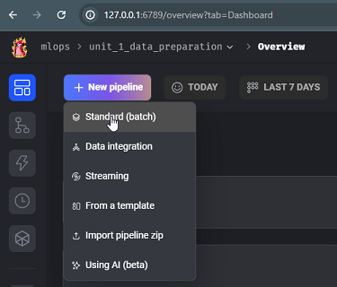

> This is my note for 2024 cohort using Mage, for 2023 cohort notes using Prefect, please see [Prefect notes](prefect.md)

# Orchestration and ML Pipelines
## 3.1. Introduction: ML pipelines and Mage
### Machine Learning Pipeline
Using notebook and just executing the cell sequentially can be a disorganized way to do an experiment because we might forget to execute some cells in order. By using pipeline we can divide the experiment flow into several steps, such as:
- data ingestion
- data transformation: filtering, removing outliers, etc
- preparing data: splitting data for the model
- hyperparameter tuning
- train model 

Orchestration is important because we need scheduling for running the experiment, collaboration among team members (data scientist, DevOps), and ensure scalability. We can use special tools for workflow orchestration, such as by using Airflow, Prefect, Mage, etc. The process is centralized so each team members can contribute and collaborate to the code. These tools usually have a dependency management to ensure each step required to do the workflow is executed properly.

### Mage
#### Running Mage in Codespace
1. Fork [Mage Github](https://github.com/mage-ai/mlops)
2. Create codespace and open using VS Code
3. Before we run the `start.sh` script, we need to create a new folder because in `docker-compose.yml` we need to have `.gitconfig` folder for local Github config.

*No .gitconfig folder for running Docker Compose*

    Create the folder: `touch .gitconfig`
4. Go back to the work folder and run the script `./scripts/start.sh `

*Start Mage script*
5. After Mage is started, we can visit the Mage UI from [`http://localhost:6789/`](http://localhost:6789/)

*Port available for opening Mage UI*

    
    
    *Mage UI*

    
    
    *Mage text editor*

6. When we edit file using Mage UI, we can also see the change in our vscode under the `mlops` folder

    

    *Mage mlops folder*

#### Running Mage with Docker (on Windows)
1. Ensure that Docker and Docker Compose is installed and Docker is running.
2. Clone Mage Github: `git clone https://github.com/mage-ai/mlops.git`
3. Move into directory `mlops`

    
4. If we run the `start.sh` script directly, there will be an error related to the path in Windows. To solve this we need to modify two files:
    - Modify `docker-compose.yml` file by editing some variables in `volumes`:
        - replacing `.` with `${PWD}`
        - adding `{}` in `MAGE_CODE_PATH`
        - adding `""` into each lines

        
    - Modify `start.sh`:  `MAGE_CODE_PATH=home/src`
    
5. Run the script: `./scripts/start.sh `

## 3.2. Data preparation: ETL and feature engineering
### Creating New Mage Project
1. Open Mage UI [`http://127.0.0.1:6789/`](http://127.0.0.1:6789/)

    
2. Open text editor and click New Mage Project menu

    
3. Since we have multi project setup, we need to select the project from the breadcrumbs. 

    
    > If the project is not registered, we need to register the project using Settings
4. Create New Pipeline -> Standard pipeline

    
    
    give a name and description to the new pipeline

    
### Data Ingestion

### Utility Helper Function

### Data Preparation

### Build Training Set

### Data Validations using Built-in Testing Framework

## 3.3. Training: sklearn models and XGBoost
- GDP Training Set
- Sklearn training GDP
- Load models
- Load models utility
- Hyperparameter tuning
- Sklearn trained
- Hyperparameter XGBoost
- XGBoost trained

## 3.4. Observability: Monitoring and alerting
- Sklearn
- XGBoost
- Overview
- Time series bar
- Histogram
- Bar chart
- Pie chart
- Setup alerts
- Email

## 3.5. Triggering: Inference and retraining
- Retraining Pipepline
- Trigger
- Predict
- Inference notebook
- Interactions
- Interactions run
- API

## 3.6. Deploying: Running operations in production
- Setup email
- Deploy
- CI/CD
- Deployed

## Homework
> will be added later

