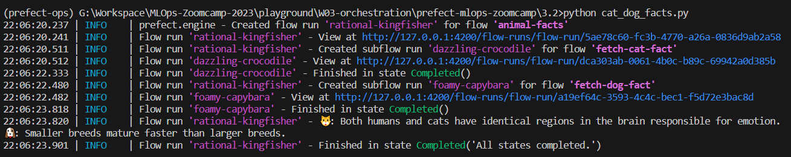

> This is a note from 2023 cohort using Prefect instead of Mage

# **Orchestration and ML Pipeline**

## **3.1. Introduction to Workflow or Orchestration**

When we implement MLOps workflow and use different systems there is a possibility that things will not work out as intended. 
Prefect allows us to orchestrate and observe our Python workflow at scale. Some tasks that can be done in Prefect:
* retry if fails
* send a message when it succeeds
* visualize dependencies in workflow
* add caching
* allow adding non technical collaborators to run ad-hoc

## **3.2. Introduction to Prefect**

Prefect is an open-source Python framework to turn standard pipelines into fault-tolerant dataflows.

### Installing Prefect
Prefect installation docs: https://docs.prefect.io/latest/getting-started/installation

To install Prefect use: `pip install -U prefect`

### **Self Hosting a Prefect Server**

Essentially, we will be hosting:
* Orchestration API: uses REST API to work with workflow metadata
* Database: a local SQLite database to store workflow metadata
* UI: visualize workflow

Prefect self hosting docs: https://docs.prefect.io/latest/host/

### The basic building block for Prefects:
* Task: think of it as regular Python function. A discrete unit of work in Prefect workflow. It takes input, performs work and produce output.
* Flow: can also be viewed as Python function but used as a container for workflow logic. Flow can be leveraged as parent function used to call task(s) and define state and data dependencies between tasks.

Each task and flow have decorators which is necessary to convert existing script into a Prefect workflow. The decorators can also accept arguments to supplements the corresponding task and flow with additional information or orchestration logic.

* Subflow: flow called by another flow

### **Setting Up Prefect Environment and Running Scripts on Prefect**

* Clone MLOps Prefect repository: `https://github.com/discdiver/prefect-mlops-zoomcamp.git`

* create Conda environment: `conda create -n prefect-ops python==3.9.12`
* activate conda environment: `conda activate prefect-ops`
* navigate into prefect folder and install prerequisites: `pip install -r requirements.txt`

* Start prefect server: `prefect server start`

* open a new terminal and navigate into the working folder. Configure Prefect to communicate with server: `prefect config set PREFECT_API_URL=http://127.0.0.1:4200/api`

### **Demo of Retry Logic & Workflow UI**
* In the example we uses `cat_facts.py` file to demonstrate the flow run. Run the Python script `python cat_facts.py`

* open the Prefect web UI `http://127.0.0.1:4200/` (see Prefect URL in server start log)

Click on the flow run and the details will be displayed

* Try running `cat_dog_facts.py`: `python cat_dog_facts.py`

* Open the web UI and there will be 3 new flow run in the list.

The `animal_facts` flow is the parent flow. If we open the detail, there are 2 subflow `fetch_cat_fact` and `fetch_dog_fact`

## **3.3. Prefect Workflow**
* Go into 3.3 folder and run the script `orchestrate.py` 

open the Prefect UI to check the workflow

## **3.4. Deploying your Workflow**
### **Development Environment**
* create new directory for new project. For example: `mkdir prefect-learn`
* `prefect project init` to create default Prefect project

there will be `prefect.yaml` file contains metadata e.g: folder name, prefect version, and repository metadata. `deployment.yaml` contains additional configuration settings to create deployment on the server (initial settings will be empty)
* add `@flow` decorator to your code's entrypiny function and save it into the new directory

### **Orchestration Environment**
* Login to Prefect cloud using `prefect cloud login` or use local Prefect server using `prefect server start`

### **Execution Environment**
* Start a worker that polls your work pool: `prefect worker start -p <poolname> -t process`
or use the Prefect UI in the Work Pools tab and change the type of worker into `Local Subprocess` to use local server

* To get the documentation for Prefect deployment, use `prefect deploy --help`

### **Deploy your flow**

### **Start a run of the deployed flow**

